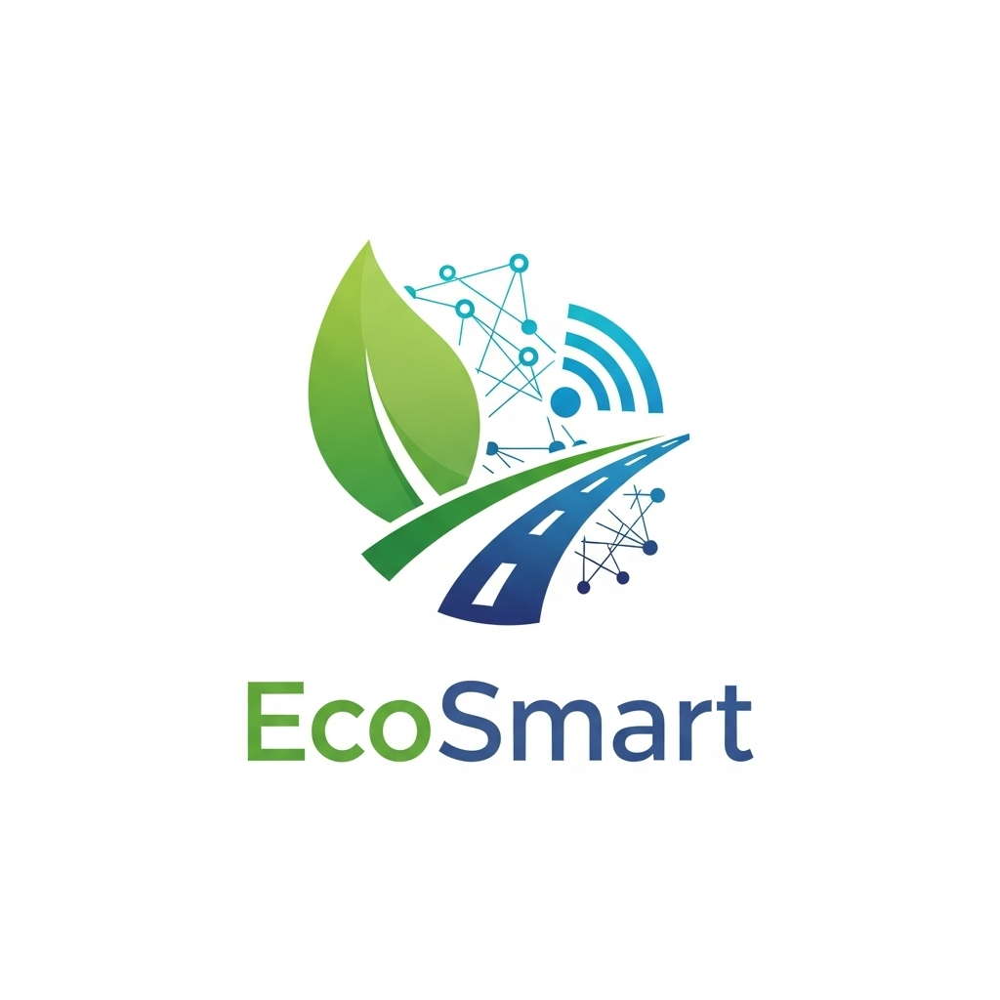

# EcoSmart Route Planner

<div align="center">
  
</div>

A sustainable transportation routing application that helps users find the most eco-friendly way to get around while providing AI-powered coaching and comprehensive environmental impact analysis.

## Inspiration

The inspiration for EcoSmart Route Planner came from a desire to create a platform that addresses the growing need for sustainable transportation solutions. Witnessing the significant impact of transportation on global carbon emissions and the lack of accessible tools for making eco-friendly travel decisions, we wanted to build a comprehensive platform that could guide users toward more sustainable transportation choices while providing personalized coaching and community engagement.

## What it does

EcoSmart Route Planner is a platform designed to help individuals make informed transportation decisions by comparing different travel modes (walking, cycling, driving, public transport) based on environmental impact, health benefits, and cost. It provides users with personalized recommendations through an AI-powered eco-coach, tracks their sustainability progress, and connects them with a community of like-minded individuals committed to reducing their carbon footprint.

## How we built it

### Idea Generation:
- Brainstormed the concept of a comprehensive sustainable transportation platform
- Conducted research on existing solutions and identified gaps in user experience and AI integration
- Analyzed the need for personalized coaching in environmental decision-making

### Design:
- Created wireframes and mockups for the multi-page application layout
- Focused on a clean, intuitive interface with Bootstrap 5 integration
- Designed responsive layouts for optimal user experience across devices

### Development:
- Used HTML5, CSS3, and JavaScript for front-end development
- Implemented a self-contained AI system with voice recognition and text-to-speech capabilities
- Integrated Bootstrap 5 for responsive design and professional UI components
- Developed a multi-page application with user authentication, route planning, and progress tracking
- Created a comprehensive user management system with LocalStorage for data persistence
- Integrated optional APIs (OpenWeatherMap, OpenRouteService) for enhanced functionality

## Challenges we ran into

**API Integration Complexity**: Initially attempted to integrate Google Maps API for real-time route visualization, but encountered billing and API key restrictions that prevented reliable functionality during development and demonstration.

**Real-time Map Implementation**: Faced technical challenges with free mapping APIs (OpenRouteService, Leaflet) where route geometry and geocoding services were inconsistent, leading to the decision to implement a clean abstract visualization instead.

**AI System Development**: Building a self-contained AI coaching system without external API dependencies required careful design of pattern matching, voice recognition integration, and response generation algorithms.

**Cross-browser Compatibility**: Ensuring consistent functionality across different browsers, particularly with Web Speech API support and CSS animations.

**User Data Persistence**: Implementing a robust user management system using LocalStorage while maintaining data integrity and providing seamless user experience across sessions.

## Accomplishments that we're proud of

Despite the technical challenges, we successfully created a fully functional sustainable transportation platform with the following achievements:

- **Complete Multi-page Application**: Developed a comprehensive web application with user authentication, route planning, AI coaching, and progress tracking
- **Self-contained AI System**: Built an innovative AI eco-coach (EcoEve) with voice recognition, text-to-speech, and personalized recommendations without external API dependencies
- **Professional UI/UX**: Created a polished, responsive interface using Bootstrap 5 with custom animations and modern design principles
- **Comprehensive Feature Set**: Implemented route comparison, environmental impact analysis, user tracking, community leaderboards, and gamification elements
- **Reliable Functionality**: Delivered a stable application that works consistently across different browsers and devices
- **Beginner-friendly Implementation**: Successfully built a complex application suitable for hackathon demonstration while maintaining code quality and documentation

## What we learned

Throughout this project, we gained valuable insights into sustainable transportation solutions and web development:

- **User-centered Design**: The importance of creating intuitive interfaces that guide users toward sustainable choices without overwhelming them with complex data
- **AI Integration**: How to build effective AI systems using pattern matching and local processing rather than relying on external APIs
- **Environmental Impact**: Deepened understanding of transportation's role in carbon emissions and the metrics that matter most to users
- **Web Development**: Advanced skills in HTML5, CSS3, JavaScript, Bootstrap integration, and responsive design
- **API Management**: Experience with integrating external services while maintaining fallback functionality for reliability
- **Project Management**: The value of iterative development, user feedback integration, and maintaining focus on core functionality
- **Community Engagement**: How gamification and social features can motivate users to adopt sustainable transportation habits

## What's next for EcoSmart Route Planner

**Real-time Map Integration**: Integrate a reliable mapping service (such as Google Maps with proper billing setup) to provide actual route visualization with turn-by-turn directions and real-time traffic data.

**Advanced AI and Machine Learning**: Implement machine learning algorithms to provide more sophisticated route recommendations based on user behavior patterns, weather conditions, and historical data.

**Mobile Application Development**: Create native iOS and Android applications to provide users with on-the-go access to route planning and AI coaching features.

**Public Transportation Integration**: Integrate with local transit APIs to provide real-time bus and train schedules, route planning, and multimodal trip optimization.

**Carbon Offset Integration**: Partner with carbon offset programs to allow users to directly offset their transportation emissions through the platform.

**Social Features Enhancement**: Expand community features with route sharing, group challenges, and local sustainability events integration.

**Data Analytics Dashboard**: Implement advanced analytics for users to track their long-term environmental impact and sustainability progress with detailed reports and insights.

## Installation & Usage

### Prerequisites
- Modern web browser (Chrome, Firefox, Safari, Edge)
- Python 3.x (for local development server)

### Quick Start

1. **Clone the repository**
   ```bash
   git clone <repository-url>
   cd HTN_Final
   ```

2. **Start the development server**
   ```bash
   python3 -m http.server 8000
   ```

3. **Configure API keys** (optional)
   ```bash
   cp config.example.js config.js
   # Edit config.js with your API keys
   ```

4. **Open your browser**
   Navigate to `http://localhost:8000`

### Getting Started

1. **Register/Login**: Create an account or log in with existing credentials
2. **Plan a Route**: Enter your start and end locations
3. **Compare Options**: Review walking, cycling, driving, and public transport options
4. **Get AI Recommendations**: Chat with EcoEve for personalized advice
5. **Track Progress**: View your eco-friendly journey statistics

## Technology Stack

- **Frontend**: HTML5, CSS3, JavaScript (ES6+), Bootstrap 5
- **AI System**: Self-contained with voice recognition and text-to-speech
- **Data Management**: LocalStorage for user data persistence
- **APIs**: OpenWeatherMap, OpenRouteService (optional)

## Project Structure

```
HTN_Final/
├── index.html              # Main application page
├── login.html              # User authentication page
├── records.html            # User records and leaderboard
├── style.css               # Main stylesheet
├── script.js               # Core application logic
├── ai-coach.js             # AI coach system
├── auth.js                 # Authentication logic
├── records.js              # Records and leaderboard logic
├── config.example.js       # Example API configuration
├── logo.png                # Project logo
├── .gitignore              # Git ignore file
└── README.md               # This file
```

## License

This project is licensed under the MIT License.

---

**Built for a more sustainable future** 🌍